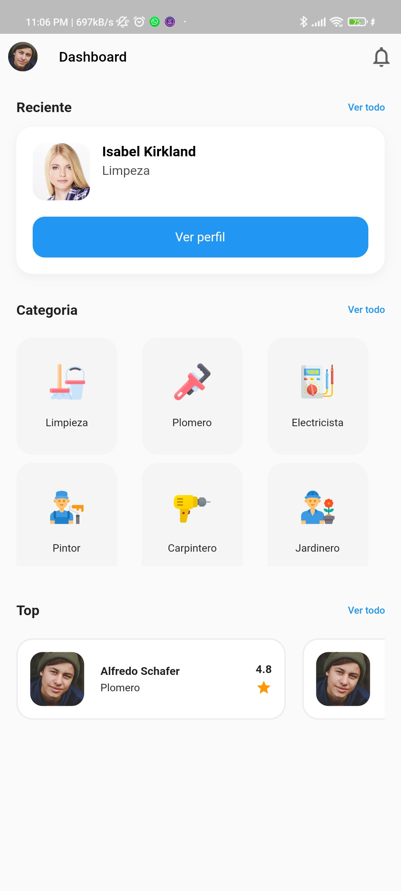

## Ejemplo de aplicación de Flutter Home Service - Día 2

## Configuración de desarrollo
Clone el repositorio y sigalos pasos:
```
flutter pub get
flutter run
```

## ScreenShot


 
 
 
 
## 📝Connect with me:
<a href="https://www.linkedin.com/in/juanshotlc/">
 
</a>
<p>  </p>
 
<a href="https://instagram.com/JuanShotLC">
    
  </a>
  <a href="https://tlgrm.in/JuanShotLC" target="_blank" rel="noreferrer"></a>
  <a href="https://www.buymeacoffee.com/JuanShotLC" target="_blank" rel="noreferrer"></a>
  <a href="https://www.youtube.com/c/JuanShotLC" target="_blank" rel="noreferrer"></a>
<a href="https://lc.jbrshot@gmail.com" target="_blank" rel="noreferrer"></a>

  ## 💰 Invítame un Café
<a href="https://www.buymeacoffee.com/JuanShotLC"></a>
